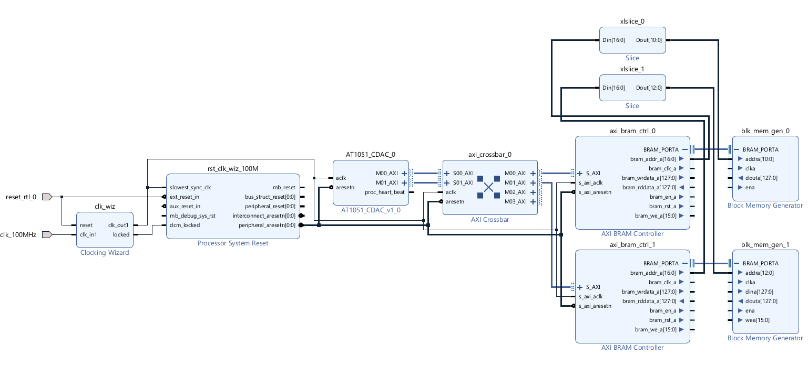
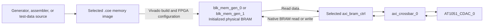

# 💾 Custom AXI-Based On-Chip Memory Subsystem

An integrated hardware architecture for high-performance on-chip memory mapping, peripheral communication, and custom IP interfacing using AXI interconnect protocols. 

[](#)
[](https://www.xilinx.com/products/design-tools/vivado.html)
[](https://opensource.org/licenses/MIT)

---

## 📌 Project Overview & Purpose

### The Challenge
Designing a custom memory subsystem directly on an FPGA presents unique timing and addressing hurdles. I spent considerable time grappling with memory mapping mismatches during the early stages of this design. Ensuring reliable communication between custom processing blocks and Block RAM (BRAM) without bottlenecking the system requires precise interconnect configuration. 

### The Solution
After weeks of refining the data paths, I built this custom AXI-based memory architecture to solve these exact communication bottlenecks. This system securely bridges custom IP logic with high-speed internal memory. 

1. **AXI Interconnect Backbone**: Provides the core routing infrastructure. In this architecture, the custom IP (`AT1051_CDAC_0`) operates as the primary AXI Master driving high-bandwidth burst transactions to the memory blocks.
2. **Integrated Block RAM**: Mapped as direct-access storage. I integrated ROM and RAM controllers to handle rapid data caching. 
3. **Custom IP Interfacing**: The system directly supports custom processing modules (`AT1051_IP`), proving its flexibility for specific computational workloads.
4. **External GPIO Link**: Essential for verifying internal states via external pins. 
5. **Serial Debugging Environment**: Configured to validate memory writes via UART, handled external to the immediate memory subsystem. 

---

## 🏗️ System Architecture & Implementation

At a high level, this architecture is a data processing pipeline that flows left to right. It begins with system initialization (clock and reset generation), feeds into the custom processing IP which acts as the system master, routes through an AXI interconnect crossbar, and terminates into two distinct domains: Phase 1 (Core Interconnect and Memory Integration) and Phase 2 (External Peripheral I/O).



### Phase 1: Core Interconnect and Memory Integration
This subsystem connects the custom processing IP, `AT1051_CDAC_0`, to two independent on-chip Block RAM memories through an AXI-based memory architecture. The custom IP is the AXI master: it initiates read and write transactions whenever it needs to fetch stored instructions, coefficients, samples, intermediate values, or other working data.
The two RAM memories are intentionally separated into two addressable regions:
1. **RAM subsystem 0**
   `axi_bram_ctrl_0` + `blk_mem_gen_0`
2. **RAM subsystem 1**
   `axi_bram_ctrl_1` + `blk_mem_gen_1`

These are not merely separate memory blocks. Each RAM subsystem requires both an AXI-facing controller and a physical BRAM implementation:

* `axi_bram_ctrl_n` converts AXI transactions into native BRAM signals.
* `blk_mem_gen_n` is the actual FPGA Block RAM storage.
* Together, these two blocks represent one memory accessible by the custom AXI master.

The `axi_crossbar_0` sits between the custom IP and the two memory subsystems. It examines the address of every transaction issued by `AT1051_CDAC_0` and routes that transaction to the correct AXI BRAM Controller. Therefore, the custom IP can access two physically separate RAMs through one AXI master interface.

Conceptually, the access path is:
```text
AT1051_CDAC_0 (AXI Master) -> axi_crossbar_0 (Address-based routing) -> axi_bram_ctrl_0 (AXI-to-BRAM conversion) -> blk_mem_gen_0 (Physical RAM 0)
AT1051_CDAC_0 (AXI Master) -> axi_crossbar_0 (Address-based routing) -> axi_bram_ctrl_1 (AXI-to-BRAM conversion) -> blk_mem_gen_1 (Physical RAM 1)
```

The clocking and reset blocks ensure that every component starts in a known state and operates synchronously.

### System Clock and Reset Infrastructure
Before discussing memory transactions, the design must establish a stable shared clock and reset domain. AXI interfaces require all connected components to agree on timing, so the clock and reset network is fundamental to the operation of every later block.

**clk_wiz** : `clk_wiz` receives the external board clock, `clk_100MHz`, and generates the internal clock, `clk_out1`.
This generated clock is connected to:

* `AT1051_CDAC_0`
* `axi_crossbar_0`
* `axi_bram_ctrl_0`
* `axi_bram_ctrl_1`
* both Block RAM generators
* the reset-generation logic

The purpose of distributing one clock domain is to ensure that AXI handshake signals, addresses, write data, and read data are sampled at consistent clock edges. Without a common clock domain, additional clock-domain-crossing logic would be required between the custom IP, crossbar, and memory controllers.

**rst_clk_wiz_100M** : The Processor System Reset block receives:

* the external reset input, `reset_rtl_0`;
* the generated clock from `clk_wiz`;
* the `locked` output from the clock wizard.

The reset block waits until the clock wizard reports a stable clock through `locked`. It then releases synchronized reset signals such as `peripheral_aresetn` and `interconnect_aresetn`.
These reset outputs are connected to the AXI components because an AXI fabric must begin in a known state:

* `AT1051_CDAC_0` is reset so it does not issue incomplete or invalid transactions during startup.
* `axi_crossbar_0` is reset so no stale routing or transaction state remains.
* `axi_bram_ctrl_0` and `axi_bram_ctrl_1` are reset so their AXI-to-BRAM conversion logic begins cleanly.

Thus, the clock and reset subsystem establishes the stable operating environment required before either RAM can be accessed.

### Custom Processing IP: AT1051_CDAC_0
`AT1051_CDAC_0` is the functional source of memory accesses. Its AXI master ports, shown as `M00_AXI`, `M01_AXI`, and related AXI channels, generate requests to read from or write to the memory system.

An AXI transaction from this block typically contains:

* an address identifying the required memory location;
* a read or write command;
* write data when performing a write;
* byte-enable information indicating which bytes are valid;
* handshake signals controlling when the transaction is accepted and completed.

The custom IP connects to `axi_crossbar_0` because it should not directly control the native BRAM ports. Native BRAM ports use low-level signals such as:

* `addra`
* `dina`
* `douta`
* `wea`
* `ena`
* `clka`

Direct use of those signals would require the custom IP to implement BRAM timing behavior and memory arbitration itself. Instead, it uses AXI, which provides a standard transaction-based interface. The crossbar and BRAM controllers handle routing and AXI-to-BRAM conversion.
Therefore, the custom IP’s output is connected to the crossbar because the crossbar is the entry point to the shared memory interconnect.

### AXI Routing Block: axi_crossbar_0
`axi_crossbar_0` receives transactions from the custom IP through its slave-side interfaces, such as `S00_AXI` and `S01_AXI`, and forwards them through its master-side interfaces, including `M00_AXI`, `M01_AXI`, and others.

The names can initially seem reversed, but they are named from the crossbar’s perspective:

* The crossbar’s `S_AXI` ports receive requests from an external AXI master.
* The crossbar’s `M_AXI` ports send requests to external AXI slaves.

Thus:

* `AT1051_CDAC_0` is the AXI master for the overall system.
* `axi_crossbar_0` acts as an AXI slave toward `AT1051_CDAC_0`.
* `axi_crossbar_0` acts as an AXI master toward the BRAM controllers.
* Each `axi_bram_ctrl_n` acts as an AXI slave toward the crossbar.

The crossbar is connected to both AXI BRAM Controllers so it can select one of the two memory regions based on transaction address.
For example, the address map may conceptually behave as follows:
| Address range | Crossbar destination | Physical memory |
| --- | --- | --- |
| Memory region 0 | `axi_bram_ctrl_0` | `blk_mem_gen_0` |
| Memory region 1 | `axi_bram_ctrl_1` | `blk_mem_gen_1` |

When the custom IP produces an address inside the first configured range, the crossbar sends the transaction to `axi_bram_ctrl_0`. When the address belongs to the second range, it sends the transaction to `axi_bram_ctrl_1`.

This is why the crossbar is placed between the custom IP and both RAM subsystems: it provides a single memory-access path from the IP while preserving separate physical RAM regions.

### RAM Subsystem 0: axi_bram_ctrl_0 and blk_mem_gen_0
The first usable RAM is formed by the pair:
`RAM subsystem 0 = axi_bram_ctrl_0 + blk_mem_gen_0`

Neither block alone is the complete AXI-accessible memory.

**axi_bram_ctrl_0: AXI-to-BRAM protocol conversion**

`axi_bram_ctrl_0` receives an AXI request from the crossbar through its `S_AXI` interface.
It is connected to the crossbar output because the crossbar has already determined that the requested address belongs to RAM subsystem 0. The controller does not need to decide between multiple system memory regions; it only converts the accepted AXI transaction into signals appropriate for its attached BRAM.

The controller generates the native BRAM-side signals:

* `bram_addr_a[16:0]`: selects the storage address;
* `bram_clk_a`: clocks the BRAM interface;
* `bram_wrdata_a[127:0]`: carries write data;
* `bram_rddata_a[127:0]`: receives read data;
* `bram_en_a`: enables the memory access;
* `bram_we_a[15:0]`: specifies which bytes are written;
* `bram_rst_a`: resets the BRAM-side interface.

The controller is necessary because AXI accesses may involve independent address, data, and response channels, while BRAM uses a simpler synchronous port interface. `axi_bram_ctrl_0` bridges these two protocols.

** Why axi_bram_ctrl_0 connects to blk_mem_gen_0**

The BRAM-side port of `axi_bram_ctrl_0` connects directly to `BRAM_PORTA` of `blk_mem_gen_0`.
This connection exists because `blk_mem_gen_0` is the actual memory storage, while `axi_bram_ctrl_0` supplies the operational signals required to access it.

The signals connect by function:
| Controller signal | BRAM signal | Purpose |
| --- | --- | --- |
| `bram_addr_a` | `addra` | Select the word to read or write |
| `bram_clk_a` | `clka` | Synchronize the memory operation |
| `bram_wrdata_a` | `dina` | Carry data into RAM during a write |
| `bram_rddata_a` | `douta` | Return stored data during a read |
| `bram_en_a` | `ena` | Enable the BRAM access |
| `bram_we_a` | `wea` | Enable writing for selected byte lanes |

The direction differs depending on the operation:

* **Write: Controller to BRAM** : Address, enable, write enable, and write data travel from `axi_bram_ctrl_0` to `blk_mem_gen_0`.
* **Read: BRAM to controller** : The controller supplies address and enable, then `blk_mem_gen_0` returns the stored word through `douta` to the controller. The controller converts it into an AXI read response and sends it back through the crossbar to `AT1051_CDAC_0`.

** blk_mem_gen_0: physical memory storage**

`blk_mem_gen_0` is the physical FPGA Block RAM configured by the Block Memory Generator IP. It exposes `BRAM_PORTA`, which is its native access interface.
It does not understand AXI transactions. It only stores bits and responds to native memory control signals. This is exactly why it is connected to `axi_bram_ctrl_0` rather than directly to the custom IP or crossbar.

### RAM Subsystem 1: axi_bram_ctrl_1 and blk_mem_gen_1
The second RAM uses the same architectural pattern:
`RAM subsystem 1 = axi_bram_ctrl_1 + blk_mem_gen_1`

`axi_bram_ctrl_1` receives transactions from a separate master-side output of the crossbar. It is connected to that output because the crossbar has decoded the transaction address and identified RAM subsystem 1 as the target.
The controller then converts AXI commands into BRAM signals for `blk_mem_gen_1`:

* `bram_addr_a` connects to `addra`;
* `bram_clk_a` connects to `clka`;
* `bram_wrdata_a` connects to `dina`;
* `bram_rddata_a` connects from `douta`;
* `bram_en_a` connects to `ena`;
* `bram_we_a` connects to `wea`.

The purpose is the same as for subsystem 0, but this pair represents a separate physical RAM and a separate AXI address range.
Keeping the RAMs separate is useful when the design needs distinct storage roles, for example:

* one RAM for instructions or configuration;
* one RAM for input/output samples or intermediate computational data;
* separate read/write workspaces;
* isolation between independent data sets.

The important conceptual point is that the two RAMs are separated by **address mapping in the crossbar**, not by the slices alone.

### Address Slice Blocks: xlslice_0 and xlslice_1
The `xlslice_0` and `xlslice_1` blocks extract selected bits from a wider signal, shown as `Din[16:0]`.
From the diagram:

* `xlslice_0` produces `Dout[10:0]`;
* `xlslice_1` produces `Dout[12:0]`.

These blocks are connected to address-related paths because not every downstream logic block needs the full 17-bit memory address. A slice block extracts only the relevant lower-order address bits.
Conceptually:
`full system address -> memory-local address bits`

This is useful when logic needs an address expressed relative to a particular memory region, such as an index into a local RAM, buffer position, instruction offset, or data offset.
For example, if a memory contains 2^11 addressable locations, only 11 address bits are needed to identify a location within that RAM. A slice can therefore provide:
`local address = system address [10:0]`

Similarly, a larger RAM region may require 13 local address bits:
`local address = system address [12:0]`

The slice blocks should be described as **address-bit extraction or local-address derivation logic**. They do not themselves route AXI transactions and do not define which controller the crossbar selects. That selection is performed by the crossbar’s configured address map.

### End-to-End Read and Write Operation
The complete write path is:
1. `AT1051_CDAC_0` generates an AXI write address and write data.
2. The transaction enters `axi_crossbar_0`.
3. The crossbar decodes the address.
4. The crossbar forwards the transaction to either `axi_bram_ctrl_0` or `axi_bram_ctrl_1`.
5. The selected controller converts AXI signals into native BRAM signals.
6. The controller asserts the relevant address, enable, byte-write-enable, and write-data signals on its attached `blk_mem_gen`.
7. The Block RAM stores the data at the selected location.
8. The controller returns an AXI write response through the crossbar to `AT1051_CDAC_0`.

The read path is:
1. `AT1051_CDAC_0` generates an AXI read address.
2. `axi_crossbar_0` decodes the address and chooses the corresponding RAM subsystem.
3. The selected AXI BRAM Controller drives the local BRAM address and read enable.
4. The appropriate `blk_mem_gen` returns the stored data on its `douta` port.
5. The controller packages that data as an AXI read response.
6. The response travels back through the crossbar to `AT1051_CDAC_0`.

### Phase 2: External Peripheral I/O

Figure 2 extends the architecture already introduced in Figure 1. 

Architecturally, Figure 2 adds an AXI-controlled external GPIO path and supporting interface blocks to the existing system. The original BRAM subsystems continue to provide internal storage, while the newly added blocks allow the design to communicate with external digital signals through `gpio_io`.

Conceptually:

* Figure 1 established how `AT1051_CDAC_0` accesses the internal BRAM memories.
* Figure 2 adds a separate AXI destination for external control or status signals.
* The AXI crossbar remains the common routing point: it sends memory-related accesses to the existing RAM paths and GPIO-related accesses to the new GPIO path.

The additional Figure 2 path is:

The existing BRAM paths are retained from Figure 1. The blocks below are explained only because they are added or newly shown in Figure 2.

### 1. GPIO Subsystem

The new external-I/O subsystem is formed by the following connected blocks:

`axi_protocol_converter_0` -> `axi_gpio_0` -> `gpio_io`

These blocks form an AXI-to-GPIO interface that allows the internal AXI system to control or observe external digital signals.

**Purpose of the GPIO subsystem**

The GPIO subsystem provides a controlled connection between:

* the internal processing and AXI system; and
* external FPGA pins or external digital hardware connected through `gpio_io`.

For example, the GPIO pins may be used for enable signals, digital control words, trigger signals, reset signals, status inputs, or simple command outputs.

### 2. Connection from axi_crossbar_0 to axi_protocol_converter_0

`axi_protocol_converter_0` receives an AXI transaction from an output of the existing AXI interconnect.

This connection is needed because the AXI crossbar is responsible for selecting the correct destination for every transaction issued by `AT1051_CDAC_0`. When the transaction address belongs to the GPIO address region, the crossbar sends that transaction to the GPIO path rather than to either of the previously defined BRAM subsystems.

The connection order is:

`AT1051_CDAC_0` -> `axi_crossbar_0` -> `axi_protocol_converter_0`

The crossbar must appear before the protocol converter because the system must first determine the destination of the transaction. Only after the transaction has been routed to the GPIO path does it need interface conversion.

**Why the protocol converter receives the crossbar output**

The crossbar output is connected to `axi_protocol_converter_0` because the AXI interface on the upstream side may not exactly match the AXI interface expected by the GPIO peripheral.

The protocol converter receives the transaction, adapts it as required, and forwards a compatible transaction to the GPIO block.

Its role is therefore:

Crossbar AXI transaction -> AXI protocol adaptation -> GPIO-compatible AXI transaction

`axi_protocol_converter_0` does not store data and does not directly drive external pins. It only ensures that AXI transactions arriving from the crossbar are presented in a form that `axi_gpio_0` can correctly accept.

### 3. Connection from axi_protocol_converter_0 to axi_gpio_0

The output interface of `axi_protocol_converter_0` connects to the AXI slave interface of `axi_gpio_0`.

`axi_protocol_converter_0` -> `axi_gpio_0`

This connection is required because the protocol converter produces the adapted AXI transaction, while `axi_gpio_0` is the block that interprets the transaction as a GPIO register read or write.

The function of each block in this connection is different:

| Block | Function in the connection |
| --- | --- |
| `axi_protocol_converter_0` | Makes the incoming AXI transaction compatible with the downstream peripheral interface |
| `axi_gpio_0` | Converts AXI register access into GPIO output values or GPIO input/status reads |

The output of the protocol converter is connected to `axi_gpio_0` specifically because GPIO requires an AXI-controlled register interface before it can change or report external digital signals.

### 4. axi_gpio_0: AXI-Controlled GPIO Peripheral

`axi_gpio_0` is the final AXI peripheral in the new path. It receives the converted AXI transaction and performs the actual GPIO operation.

It acts as an AXI-accessible register block:

* A **write** transaction updates a GPIO output register.
* A **read** transaction returns the current GPIO input or status value.

**GPIO write path**

When `AT1051_CDAC_0` writes to the GPIO address range, the operation proceeds as follows:

1. The custom IP issues an AXI write transaction.
2. The existing crossbar routes the transaction to the GPIO path.
3. `axi_protocol_converter_0` adapts the transaction.
4. `axi_gpio_0` receives the write operation.
5. `axi_gpio_0` stores the written value in its GPIO output register.
6. The output register drives the corresponding `gpio_io` signal.

**GPIO read path**

When external hardware provides a digital input or status value:

1. The external value appears at `gpio_io`.
2. `axi_gpio_0` samples or exposes that value through its GPIO register.
3. `AT1051_CDAC_0` issues an AXI read transaction to the GPIO address range.
4. `axi_gpio_0` returns the GPIO value through the protocol converter and crossbar.
5. The custom IP receives the external status information.

### 5. Connection from axi_gpio_0 to gpio_io

The GPIO interface of `axi_gpio_0` connects to the top-level port `gpio_io`.

`axi_gpio_0` -> `gpio_io` -> external digital hardware

This connection is necessary because AXI transactions exist only inside the FPGA design. They cannot directly reach physical pins or external circuitry. `axi_gpio_0` converts the internal register value into a digital signal that can leave the design through `gpio_io`.

Therefore:

* `axi_gpio_0` is the internal AXI-controlled peripheral.
* `gpio_io` is the external hardware-facing interface.

This connection forms the boundary between the internal programmable logic and the external device or board-level signal.

### 6. axi_dwidth_converter_0

`axi_dwidth_converter_0` is an AXI data-width adaptation block shown in Figure 2.

It is used when the AXI interface on one side of the connection uses a different data width from the interface on the other side. For example, an upstream AXI path may transfer a wider data word than the downstream path can accept.

Its purpose is:

AXI transaction with one data width -> `axi_dwidth_converter_0` -> AXI transaction with a compatible data width

The width converter adjusts the transaction data, byte-enable information, and address alignment as necessary. This prevents incorrect interpretation of data when two connected AXI interfaces use different bus widths.

It is connected after an AXI routing output because the crossbar first identifies the intended destination path. The data-width converter then ensures that the transaction width is correct for the next interface on that path.

`axi_dwidth_converter_0` is an interface-adaptation block. It is not a RAM block and does not independently store application data.

### 7. xlslice_0 and xlslice_1

Figure 2 also shows two `xlslice` blocks:

* `xlslice_0`
* `xlslice_1`

An `xlslice` block extracts selected bits from a wider signal. In this design, the visible inputs are address-related buses, and the outputs are narrower address fields.

Conceptually:

wide address bus → `xlslice` → local address bits

For example:

Din [16:0] -> `xlslice` -> Dout [10:0]

or:

Din [16:0] -> `xlslice` -> Dout [12:0]

**Why the slice blocks are connected to address signals**

A downstream block may not need the complete address generated by the BRAM-side logic. It may require only the lower-order bits that identify a location within a local memory region or a smaller internal address space.

The slice block is connected to the wider address output because it derives the reduced-width local address needed by the following connection.

For example:

local_address = full_address[10: 0]

The slice output is therefore useful wherever only the local address index is required.

These slice blocks do not choose between the existing RAM paths and the GPIO path. Routing remains the responsibility of the existing AXI crossbar. The slice blocks only extract the required portion of an already generated address signal.

### 8. Figure 2 Add-On Summary

Figure 2 adds an external GPIO communication path to the internal-memory architecture already established in Figure 1.

The key connection logic is:

1. The existing crossbar identifies that an address belongs to the GPIO range.
2. It sends the transaction to `axi_protocol_converter_0`.
3. The converter adapts the AXI transaction for the GPIO peripheral.
4. `axi_gpio_0` converts the AXI register operation into an external digital signal or returns an external input/status value.
5. `gpio_io` carries that signal between the FPGA design and external hardware.
6. The data-width converter and slice blocks support compatible data transfer and local address extraction on their respective paths.


---


---

### Phase 3: BRAM Initialization with COE Files

Phase 3 adds the initial memory-image workflow to the RAM architecture described in Phase 1. It does not add a new AXI connection or alter the established run-time memory path. Instead, it defines the values that are already present in `blk_mem_gen_0` and/or `blk_mem_gen_1` after FPGA configuration.

The existing RAM paths remain:

```text
AT1051_CDAC_0 -> axi_crossbar_0 -> axi_bram_ctrl_0 -> blk_mem_gen_0
AT1051_CDAC_0 -> axi_crossbar_0 -> axi_bram_ctrl_1 -> blk_mem_gen_1
```

A COE file is assigned only to `blk_mem_gen_0` or `blk_mem_gen_1`. These blocks implement the physical BRAM arrays. The preceding blocks route and translate AXI transactions at run time, so they are not initialization-file targets.

#### Why COE Files Are Used

A `.coe` file is a plain-text Vivado memory-initialization file. Vivado reads it during the build flow and places its values into the FPGA configuration data. When the FPGA is configured, the selected BRAM starts with deterministic, predefined contents.

This is useful when `AT1051_CDAC_0` must read known values immediately after start-up, such as CDAC control codes, boot commands, GPIO test patterns, UART simulation data, calibration values, lookup tables, or verification vectors.

The included initialization images are:

| File | Intended use |
|---|---|
| `boot.coe` | Initial or boot-oriented memory contents. |
| `GPIO_sim.coe` | GPIO simulation input or test data. |
| `GPIO_toggle.coe` | GPIO toggle-pattern test data. |
| `UART_sim.coe` | UART simulation data. |

Select an image only after confirming that its word width, depth, radix, and intended address layout match the Block Memory Generator configuration and the memory-access logic in `AT1051_CDAC.v`.

#### Where the COE File Is Applied

In Vivado, open the configuration for the chosen `blk_mem_gen` IP, enable **Load Init File** in the memory initialization or **Other Options** settings, and select the required `.coe` file. Then regenerate output products if Vivado requests it and rebuild the bitstream.

Do not attach a COE file to the following blocks:

| Block | Why it does not receive the COE file |
|---|---|
| `AT1051_CDAC_0` | It is the custom AXI master that later reads and writes memory. |
| `axi_crossbar_0` | It routes transactions by address; it does not store memory words. |
| `axi_bram_ctrl_0` / `axi_bram_ctrl_1` | They convert AXI transactions into native BRAM signals; they are not the storage arrays. |

#### COE Creation and Update Process

1. **Choose the data purpose.** Decide whether the target BRAM holds boot data, CDAC control codes, GPIO patterns, UART simulation data, calibration values, or test vectors.
2. **Check the BRAM parameters.** Confirm word width and depth in the selected `blk_mem_gen` configuration. Every entry must fit within one word, and the entry count must not exceed the configured depth.
3. **Generate the values.** Create raw values with a reproducible script, an assembler, MATLAB, Python, C, or another appropriate tool.
4. **Write valid COE syntax.** Define the radix and the initialization vector. Entries are loaded into consecutive memory locations, beginning at address zero unless the memory image is designed otherwise.
5. **Assign the file to the physical BRAM.** Select it in `blk_mem_gen_0` or `blk_mem_gen_1`, not in an AXI routing or controller block.
6. **Rebuild the FPGA image.** A changed COE file requires synthesis/implementation and a newly generated bitstream before the board receives the updated data.
7. **Verify the contents.** Use the existing AXI path to read known addresses and compare the returned values with the selected COE entries.

A hexadecimal COE file has this form:

```text
memory_initialization_radix=16;
memory_initialization_vector=
0000,
0001,
0003,
0007,
000F;
```

The final value must end with a semicolon. For a 16-bit BRAM word, each hexadecimal entry normally contains four hexadecimal digits. Use the actual configured BRAM word width when producing project images.

#### Build-Time and Run-Time Connection



The top connection occurs at **build/configuration time**: Vivado uses the COE file to initialize BRAM. The lower connection occurs at **run time**: `AT1051_CDAC_0` reads or overwrites the resulting BRAM contents through the existing AXI path. If logic writes a location during operation, the new value replaces the value originally loaded from the COE file.


---

## 📂 Directory Structure

```text
.
├── AT1051_CDAC.v             # Custom Verilog source for AT1051_CDAC_0
├── component.xml             # Vivado IP-packaging metadata
├── AT1051_CDAC_v1_0.tcl      # Vivado IP-packaging/support script
├── boot.coe                  # BRAM initialization image for boot data
├── GPIO_sim.coe              # BRAM initialization image for GPIO simulation
├── GPIO_toggle.coe           # BRAM initialization image for GPIO toggle testing
├── UART_sim.coe              # BRAM initialization image for UART simulation
├── GPIO_toggle.bin           # Binary image used for GPIO toggle testing
├── AT1051.xdc                # FPGA pin and I/O constraints, including gpio_io mapping
├── pre_tcl.tcl               # Vivado setup script
├── GPIO connection.png       # External GPIO block-design figure
├── rom,ram_integration.png   # Core RAM/interconnect block-design figure
└── README.md                 # Project documentation
```
---
To understand what each file in this project does and how it fits into Vivado, check out our [Architecture Guide](ARCHITECTURE.md).

## 💻 Prerequisites & Setup

### Environment Requirements
* **FPGA Toolchain**: AMD Xilinx Vivado (Development was targeted for standard 7-series or UltraScale boards).
* **Serial Terminal**: Tera Term or PuTTY.

### Getting Started
I designed the workspace to be as self-contained as possible. 

1. **Clone the Repository**: Download the project files to your local machine.
2. **Add or package the custom IP**: Use `AT1051_CDAC.v` with `component.xml` and `AT1051_CDAC_v1_0.tcl` so Vivado can recognize `AT1051_CDAC_0` as reusable custom IP.
3. **Open the block design and configure BRAM initialization**: If a preloaded memory image is required, assign the appropriate `.coe` file to the target `blk_mem_gen` IP.
4. **Apply constraints and setup**: Ensure `AT1051.xdc` and `pre_tcl.tcl` are included in the Vivado project. Confirm that the `gpio_io` pin assignments match the target board.
5. **Generate the bitstream**: Run synthesis, implementation, and bitstream generation.
6. **Program the board**: Program the FPGA through Vivado Hardware Manager.

---

## 🚀 Hardware Validation & Debugging

Verifying an AXI subsystem takes patience. I relied heavily on serial debugging to confirm memory writes. 

### Running Serial Tests
1. Download and install a serial terminal application like Tera Term.
2. Connect your FPGA board via USB-UART.
3. Open Tera Term. Configure the baud rate (typically 115200) and select the correct COM port.
4. Initialize a memory write sequence from the processor. The terminal will output hexadecimal transaction logs confirming successful BRAM access. 

---


